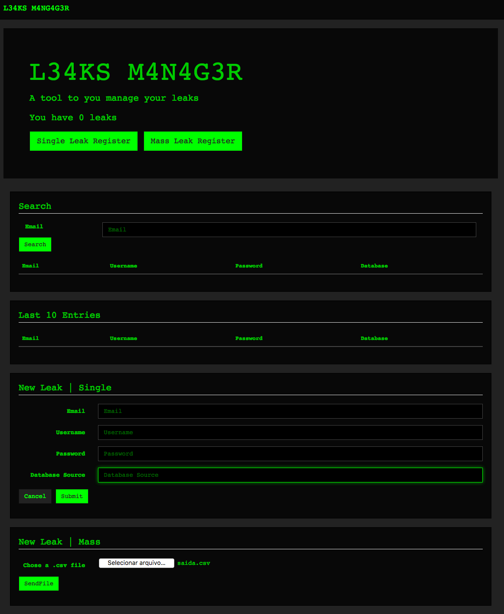

# LeakManager

# Install
<pre>
sudo apt-get install mongodb-org
pip3 install -r requeriments.txt
</pre>

# Usage
<pre>
hug -f index.py -p 1337
OR
gunicorn index:__hug_wsgi__ -b 0.0.0.0:1337
OR
uwsgi --http 0.0.0.0:1337 --wsgi-file index.py --callable __hug_wsgi__
</pre>

# Change user/passwd
<pre>
edit etc/LeakManager.conf file
</pre>

